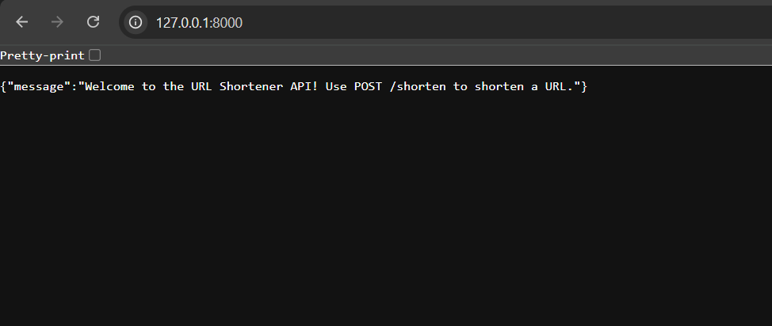

# DevOps URL Shortener

A Python FastAPI web application to shorten URLs with an **automated CI/CD pipeline** using Jenkins and Docker.

## Tech Stack
- **Backend:** Python, FastAPI
- **Containerization:** Docker
- **CI/CD:** Jenkins
- **Version Control:** GitHub

## Features
- Shorten long URLs into tiny links
- Retrieve original URL via short URL
- Fully automated Docker build and push
- CI/CD pipeline demonstrates DevOps workflow

## CI/CD Flow
GitHub → Jenkins → Docker Hub → Docker Container
- Jenkins pulls the latest code from GitHub
- Builds Docker image for the app
- Logs into Docker Hub using credentials
- Pushes the Docker image to Docker Hub

## How to Run Locally
```bash
# Clone the repo
git clone https://github.com/nidhi8901/devops-url-shortener.git
cd devops-url-shortener

# Install dependencies
pip install -r requirements.txt

# Run the app
uvicorn main:app --reload

# Build Docker image
docker build -t url-shortener-app .

# Run Docker container
docker run -d -p 8000:8000 url-shortener-app

## App Screenshot

